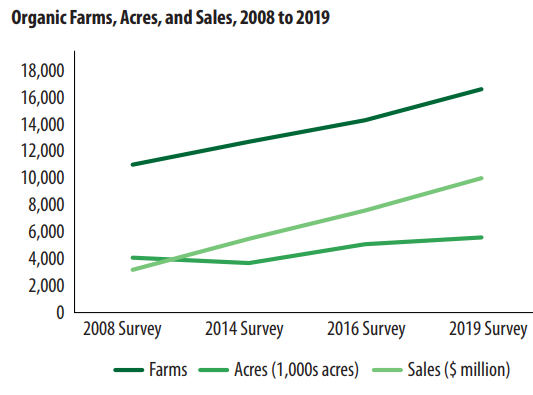

# US State Organic Ag

-   Trends of USA Organic Agriculture trends on farm numbers, hectares, and sales over the years.
-   panel data analysis?
-   goal: predict farm number, area, and sales for next three census (2022, 2027, 2032)

### Abstract

Organic Agriculture in the United States: Increase Trends in Regenerative Land Management strategies and challenges.

The need to reduce negative impacts of agriculture on the environment and the consumer demands for food produced without synthetic chemical inputs have led to organic agriculture production systems. The United States (US) commands about half of the market share of organic produce worldwide and is also home to about half of the world's organic farmers, but limited information is available on trends in land-use, on-farm practices, and challenges in organic crop production systems. This study used 2007, 2012, and 2019 agriculture census data from the United States Department of Agriculture (USDA) to investigate trends in the US organic agriculture market, on-farm regenerative practices, and challenges. From 2007 to 2017, the number of certified organic farms, land area, and sales value increased by 15, 35, and 214%, respectively. The most common regenerative agriculture practice in certified organic crop production systems is the use of green and animal manures. All regenerative practices evaluated trended positive (1-25%) except organic mulches and composts use, which reduced by 9%. The most significant primary challenges faced by certified organic farmers were related to organic practices regulations and production costs with remarkably increasing trends (115 to 428%) for all investigated challenges from 2007 to 2017. The US certified organic production has enormous future potentials in farm numbers, land area, market, and their increasing contribution to the environmentally friendly regenerative practices. However, this sector requires efforts to address the primary challenges facing the organic farmers, and this will necessitate farm-level research and policy reviews with farmers involvement.

## Content

### Raw Data

**Preprocessing:** Data were copied from TXT and PDF files provided by the USDA Organic Production Surveys: <https://www.nass.usda.gov/Surveys/Guide_to_NASS_Surveys/Organic_Production/index.php>. Units were converted from acres to hectares.

**Variables:**

-   `state`

-   `year`

-   `farm_number`: number of farms

-   `farm_ha`: area of farms in hectares (ha) converted from reported areas using a conversion factor of 2.47 ha/a

-   `farm_sales`: total sales (USD); adjusted to 2020 dollars by dividing sales for each year by the adjustment factor provided by the [U.S. Bureau of Labor Statistics CPI Inflation Calculator](https://www.bls.gov/data/inflation_calculator.htm) comparing from July in year Y to July in 2020.

    +-------+-------------------------+
    | Year  | $\textbf{CPI}_{Y/2020}$ |
    +=======+=========================+
    | 2008  | 1.18                    |
    +-------+-------------------------+
    | 2014  | 1.09                    |
    +-------+-------------------------+
    | 2016  | 1.08                    |
    +-------+-------------------------+
    | 2019  | 1.01                    |
    +-------+-------------------------+

-   `[variable]_cv`^\*^: coefficient of variance for `[variable]`

^\*^defined as "statistical precision estimates for the number of farms and acres and the total value of sales for the United States and for each state." collected for 2016, 2019; also available for [2014](https://www.nass.usda.gov/Publications/AgCensus/2012/Online_Resources/Organics/ORGANICS.txt), [2015](https://downloads.usda.library.cornell.edu/usda-esmis/files/zg64tk92g/pr76f6075/hx11xj08s/OrganicProduction-09-15-2016.txt)

**Note:**

> "The 2014 and 2015 Organic Certifier Survey data is a tabulation of USDA-accredited organic certifiers' acreage and livestock data received. The data underwent editing, summarization, and disclosure programming prior to publishing. The 2008, 2011, 2014, and 2015 organic producer surveys as well as the 2007 and 2012 Census of Agriculture collected and published data on organic operations which had production in the reference year. The data from these programs were adjusted for non-response, misclassification, and coverage. Therefore, the certifier survey data and producer survey/census data are not comparable and data users should account for these differences whenreviewing the data. Data users should allow for differences when comparing the data between datasets including reference periods, organic definitions, and differing survey methodologies." - USDA 2016

**Sources of data:**

| census year $^\star$ | survey year $^\star$ | publication year | farms | area | sales | source      | raw data                                                                                                                                                                           | file                                      | used                                   | QA$^\S$ |
|----------------------|----------------------|------------------|-------|------|-------|-------------|------------------------------------------------------------------------------------------------------------------------------------------------------------------------------------|-------------------------------------------|----------------------------------------|---------|
| 1997                 |                      | 2001             | X     |      |       | Greene 2001 | [PDF](raw_data/Greene_2001.pdf)                                                                                                                                                    | 1997\_area.csv                            | No; not comparable (pre certification) |         |
| 2007                 | **2008**             | 2010             | X     | X    | X     | USDA 2010   | Table 1$^\dagger$ [TXT](https://www.nass.usda.gov/Publications/AgCensus/2007/Online_Highlights/Organics/ORGANICS.txt)                                                              | 2008\_2014\_2017\_number\_area\_sales.csv | Yes                                    | Yes     |
| NA                   | 2011                 | 2012             | X     | X    | X     | USDA 2012   | Table 1 [TXT](https://downloads.usda.library.cornell.edu/usda-esmis/files/zg64tk92g/8623j1717/4b29b896g/OrganicProduction-10-04-2012.txt)                                          | 2011\_number\_area\_sales.csv             | No$^\ddagger$                          | Yes     |
| 2012                 | **2014**             | 2016             | X     | X    |       | USDA 2016   | Table 1$^\dagger$ [TXT](https://www.nass.usda.gov/Publications/AgCensus/2012/Online_Resources/Organics/ORGANICS.txt)                                                               | 2008\_2014\_2017\_number\_area\_sales.csv | Yes                                    | Yes     |
| NA                   | 2015                 | 2016             | X     | X    |       | USDA 2016   | [PDF](raw_data/OrganicProduction-09-15-2016.pdf) [TXT](https://downloads.usda.library.cornell.edu/usda-esmis/files/zg64tk92g/pr76f6075/hx11xj08s/OrganicProduction-09-15-2016.txt) |                                           | No$^\ddagger$                          |         |
| NA                   | **2016**             | 2017             | X     | X    | X     | USDA 2017a  | Table 1$^\dagger$ [TXT](https://downloads.usda.library.cornell.edu/usda-esmis/files/zg64tk92g/70795b52w/6q182n781/OrganicProduction-09-20-2017_correction.txt)                     | 2016\_number\_area\_sales.csv             | Yes, used in fig below$^\ddagger$      | Yes     |
| 2017                 | **2019**             | 2020             | X     | X    | X     | USDA 2020   | Table 1$^\dagger$ [TXT](https://www.nass.usda.gov/Publications/AgCensus/2017/Online_Resources/Organics/ORGANICS.txt)                                                               | 2008\_2014\_2017\_number\_area\_sales.csv | Yes                                    | Yes     |

-   $^\star$ "census year" is the year of the USDA Census; "survey year" is the year data was collected (different because the organic census is a follow on to the overall census
-   $^\ddagger$ "Data users should allow for differences when comparing data between the 2011 COPS and the 2008 Organic Production" USDA 2010 Greene, Catherine R. (2001) US organic farming emerges in the 1990s: adoption of certified systems. No. 1474-2016-120887. 2001.
-   $^\dagger$number of farms from first line of table - previously the second line was used for 2008 and 2012 and first in 2016 and 2019
-   $^\S$ csv files cross referenced w/ original data source at state level and for US totals

USDA (2010) "2008 Organic Production Survey" [TXT](https://www.nass.usda.gov/Publications/AgCensus/2007/Online_Highlights/Organics/ORGANICS.txt)X

USDA (2012) "2011 Certified Organic Production Survey" [TXT](https://downloads.usda.library.cornell.edu/usda-esmis/files/zg64tk92g/8623j1717/4b29b896g/OrganicProduction-10-04-2012.txt)

USDA (2016) "2014 and 2015 Organic Certifier Data" [pdf](https://www.nass.usda.gov/Surveys/Guide_to_NASS_Surveys/Organic_Production/Organic_Certifiers/2016/USDA_Accredited_Certifying_Agent_Certified_Organic_Data_2014_2015.pdf). (Raw data from [2014](https://www.nass.usda.gov/Publications/AgCensus/2012/Online_Resources/Organics/ORGANICS.txt), [2015](https://downloads.usda.library.cornell.edu/usda-esmis/files/zg64tk92g/pr76f6075/hx11xj08s/OrganicProduction-09-15-2016.txt))

USDA (2017) "2016 Certified Organic Survey" [TXT](https://downloads.usda.library.cornell.edu/usda-esmis/files/zg64tk92g/70795b52w/6q182n781/OrganicProduction-09-20-2017_correction.txt)

USDA (2020) "2019 Certified Organic Survey" Volume 3 Special Studies Part 4. AC-17-SS-4: [TXT](https://www.nass.usda.gov/Publications/AgCensus/2017/Online_Resources/Organics/ORGANICS.txt)

### Analysis Code

### Found in `code/` folder.

-   `01-merge_data.R` combines files from `raw_data` folder to generate `all_transformed.R`
-   `02-exploratory_analysis.R` some plots and a simple linear regression
-   `03-regression.R` initial modeling using `brms` for multivariate glm with missing data

### Found in `/code/BUGS/mod2` folder.
-   `mod_2a.R` contains a multivariate normal Bayesian model regressing farm number, area, and sales on year
-   `01_run_model.R` modifies `all_transformed.csv` (log response variables, year centered on 2000) and models data with `mod_2a.R`; produces a coda object 
-   `02_check_convergence.R` visually and algorithmically inspect for convergence; produces starting values
-   `03_plot_parameters.R` plots the slope and intercept, random effects, and variance and covariance terms
-   `04_assess_fit.R` runs model for replicated data and assesses model fit 
-   `fig_2a/` contains generated plots
-   `predicted_2a.csv` contains input data in long format (with missing values) and predicted values with the central 95% credible interval (complete)

### Derived Data

### TODO

-   QA

    -   Compared all references that are used in analysis against csv files in raw\_data

    -   This figure from the "[Organic Farming: Results from 2019 Organic Survey](https://www.nass.usda.gov/Publications/Highlights/2020/census-organics.pdf)" implies that USDA has reliable, consistent data for 2008, 2014, 2016, 2019

        -   However, the available data for, e.g., 2008 (first cell of Table 1 from [USDA 2010](https://www.nass.usda.gov/Publications/AgCensus/2007/Online_Highlights/Organics/ORGANICS.txt))- total organic farms in US is 14,540; much higher than in the figure ...

    -   Have reviewed, and will assume figure is in error. Email sent to NASS on 2021-05-12

    

### Contact Info

Project Lead: Dr. Isaac Mpanga Area Associate Agent Commercial Horticulture and Small Acreage 2830 N Commonwealth Dr, Camp Verde, AZ 86322 email: [mpangai\@arizona.edu](mailto:mpangai@arizona.edu)

Analysis in this repository: David LeBauer ([dlebauer\@arizona.edu](mailto:dlebauer@arizona.edu)) and Jessica Guo ([jessicaguo\@arizona.edu](mailto:jessicaguo@arizona.edu))
