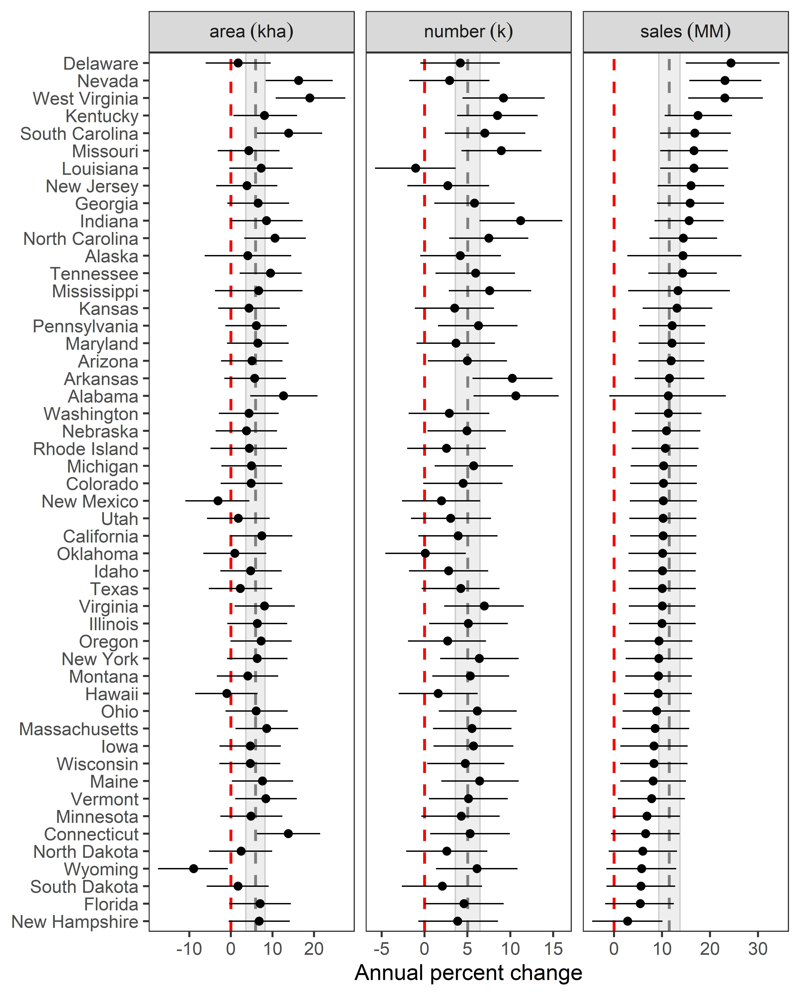

# Data and Code from: On-farm land management strategies and production challenges in United States Organic Agricultural Systems.

Isaac Mpanga, Russel Trondstad, Jessica Guo, David LeBauer, and John
Omololu, 2021. On-farm land management strategies and production
challenges in United States Organic Agricultural Systems. Current
Research in Environmental Sustainability.

It provides USDA Surveys of Agricultural Production from 2008-2019 to
investigate state and national trends by state in organic farm area,
number, and sales, as well to evaluate national trends in on-farm
land-use practices and challenges facing US organic production.

It also includes code used to transform, visualize, and analyze the
data, and derived data products - notably organic farm area and sales
with values imputed to correct for redacted state level measures.

## Repository Content

### Raw Data

#### Sources of data

Farm sales, area, and number data were downloaded from the USDA
Quickstats database and preprocessed by USDA NASS Statistician.

**Preprocessing:** Data were originally copied from TXT and PDF files
provided by the USDA Organic Production Surveys. We later learned how to
access these data from the Quickstats database, the extraction and
comparison of the data from two sources helped confirm that the values
were what we were looking for (not that we had any reason to doubt
NASS!):

But, the sources below - except Greene 2001 which we didn’t end up using
becuase it is not cmparable - can all be found here:
<https://www.nass.usda.gov/Surveys/Guide_to_NASS_Surveys/Organic_Production/index.php>.

| census year ⋆ | survey year ⋆ | publication year | farms | area | sales | source      | raw data                                                                                                                                                                           | file                                      | used                                   | QA∧ |
|--------------------------|--------------------------|------------------|-------|------|-------|-------------|------------------------------------------------------------------------------------------------------------------------------------------------------------------------------------|-------------------------------------------|----------------------------------------|----------------|
| 1997                     |                          | 2001             | X     |      |       | Greene 2001 | [PDF](raw_data/Greene_2001.pdf)                                                                                                                                                    | 1997\_area.csv                            | No; not comparable (pre certification) |                |
| 2007                     | **2008**                 | 2010             | X     | X    | X     | USDA 2010   | Table 1† [TXT](https://www.nass.usda.gov/Publications/AgCensus/2007/Online_Highlights/Organics/ORGANICS.txt)                                                            | 2008\_2014\_2017\_number\_area\_sales.csv | Yes                                    | Yes            |
| NA                       | 2011                     | 2012             | X     | X    | X     | USDA 2012   | Table 1 [TXT](https://downloads.usda.library.cornell.edu/usda-esmis/files/zg64tk92g/8623j1717/4b29b896g/OrganicProduction-10-04-2012.txt)                                          | 2011\_number\_area\_sales.csv             | No‡                         | Yes            |
| 2012                     | **2014**                 | 2016             | X     | X    |       | USDA 2016   | Table 1† [TXT](https://www.nass.usda.gov/Publications/AgCensus/2012/Online_Resources/Organics/ORGANICS.txt)                                                             | 2008\_2014\_2017\_number\_area\_sales.csv | Yes                                    | Yes            |
| NA                       | 2015                     | 2016             | X     | X    |       | USDA 2016   | [PDF](raw_data/OrganicProduction-09-15-2016.pdf) [TXT](https://downloads.usda.library.cornell.edu/usda-esmis/files/zg64tk92g/pr76f6075/hx11xj08s/OrganicProduction-09-15-2016.txt) |                                           | No‡                         |                |
| NA                       | **2016**                 | 2017             | X     | X    | X     | USDA 2017a  | Table 1† [TXT](https://downloads.usda.library.cornell.edu/usda-esmis/files/zg64tk92g/70795b52w/6q182n781/OrganicProduction-09-20-2017_correction.txt)                   | 2016\_number\_area\_sales.csv             | Yes, used in fig below‡     | Yes            |
| 2017                     | **2019**                 | 2020             | X     | X    | X     | USDA 2020   | Table 1† [TXT](https://www.nass.usda.gov/Publications/AgCensus/2017/Online_Resources/Organics/ORGANICS.txt)                                                             | 2008\_2014\_2017\_number\_area\_sales.csv | Yes                                    | Yes            |

-   ⋆ “census year” is the year of the USDA Census; “survey
    year” is the year data was collected (different because the organic
    census is a follow on to the overall census.
-   ⋆ only surveys conducted in 2008, 2012, 2016, and 2019
    are used in the present analysis
-   ‡ “Data users should allow for differences when comparing
    data between the 2011 COPS and the 2008 Organic Production” USDA
    2010 Greene, Catherine R. (2001) US organic farming emerges in the
    1990s: adoption of certified systems. No. 1474-2016-120887. 2001.
-   †number of farms from first line of table - previously
    the second line was used for 2008 and 2012 and first in 2016 and
    2019
-   ∧ csv files cross referenced w/ original data source at
    state level and for US totals

#### Contents of the \`[raw\_data/](raw_data) folder

This folder contains inputs to analyses. Each file contains the Census
year, the name of the practice or challenge, and the number of farmers
reporting.

-   [challenges.csv](raw_data/challenges.csv) contains results from
    survey of challenges faced by farmers at the national level.
-   [practices.csv](raw_data/practices.csv) contains results from survey
    of practices adopted by farmers at the national level

Area, Number, and Sales for 2008, 2011, 2014, 2015, 2016, 2019:

-   [E2E0BF24-9F88-35DB-8526-8E47D941FDBF.csv](raw_data/E2E0BF24-9F88-35DB-8526-8E47D941FDBF.csv)
    was downloaded from USDA Quickstats Database (2021) at the URL and
    is the original source of data used in this analysis.
-   [organic tables.xlsx](raw_data/organic%20tables.xlsx) was provided
    by USDA NASS Statistician Virginia Harris. This sheet was used to
    organize the raw data and provide corrections and analysis of the
    impact of changes in survey methodology described below.

The three files used as the starting point for this analysis were
exported from the spreadsheet provided by USDA NASS. These files contain
state level area, number, and sales in the three files below after
corrections. - [farm\_area.csv](raw_data/farm_area.csv) contains -
[farm\_number.csv](raw_data/farm_number.csv) contains -
[farm\_sales.csv](raw_data/farm_sales.csv) contains -
[2008.csv](raw_data/farm_sales.csv) contains farm area, number, and
sales data from 2008 corrected for the fact that exempt farms were not
included in these numbers.

**Note:**

> “The 2014 and 2015 Organic Certifier Survey data is a tabulation of
> USDA-accredited organic certifiers’ acreage and livestock data
> received. The data underwent editing, summarization, and disclosure
> programming prior to publishing. The 2008, 2011, 2014, and 2015
> organic producer surveys as well as the 2007 and 2012 Census of
> Agriculture collected and published data on organic operations which
> had production in the reference year. The data from these programs
> were adjusted for non-response, misclassification, and coverage.
> Therefore, the certifier survey data and producer survey/census data
> are not comparable and data users should account for these differences
> whenreviewing the data. Data users should allow for differences when
> comparing the data between datasets including reference periods,
> organic definitions, and differing survey methodologies.” - USDA 2016

As advised, we consulted with NASS about combining these data across
multiple surveys, and have made the corrections suggested.

The key difference in survey methodology that is accounted for is that
the 2008 and 2014 surveys included both certified and organic farms. The
other surveys were just certified farms. we are using include both
exempt and certified organic farms in is whether the estimate is for all
organic farms (including exempt from certification farms) or just
certified organic farms. Exempt farms are defined as farms with less
than $5k / y in sales. We corrected for these by multiplying the number
of exempt farms by $2,500 which accounted for much less than 1% of
total.

In summary, the scope of the surveys included:

-   2008 - certified & exempt
-   2011 - certified only
-   2014 - certified & exempt
-   2015 - certified; this survey is more sparse because the focus was
    specifically to collect Risk Management Agency (RMA) data for crop
    insurance policy purposes; there is a lot of information on crops
    and livestock but less on organic farming practices
-   2016 - certified only
-   2019 - certified only

In addition, prior to the 2019 organic survey, farmers were asked if
they used animal or green manure as a single question; in 2019 this
question was asked separately.

### Derived Data

#### Transformations and Removal

Raw data were changed in the following ways:

For practices and challenges, census years were converted to survey
years following the table of sources above. (2007 census –&gt; 2008
survey; 2012–&gt; 2014; 2017–&gt; 2019). This accounts for the fact that
the Organic survey was done after but still within the scope of, a
particular census.

Area units were converted from acres to hectares using a conversion
factor of 2.47 ha/a.

Sales figures were adjusted to 2020 dollars by dividing sales for each
year by the adjustment factor below obtained from the [U.S. Bureau of
Labor Statistics CPI Inflation
Calculator](https://www.bls.gov/data/inflation_calculator.htm) comparing
from July in year Y to July in 2020.

| Year | Conversion $\\frac{\\textrm{CPI}\_{2020}}{\\textrm{CPI}\_{\\textrm{Year}}}$ |
|:-----|:----------------------------------------------------------------------------|
| 2008 | 1.22                                                                        |
| 2011 | 1.17                                                                        |
| 2014 | 1.10                                                                        |
| 2015 | 1.10                                                                        |
| 2016 | 1.09                                                                        |
| 2019 | 1.02                                                                        |

Farm area, number, and sales figures for 2008 were adjusted for missing
data. We removed the Alaska farm area value from all analyses because is
an extreme outlier, because subsequent years were not reported, and
because a one year, 2500x increase in farm area coinciding with a
decrease in farm number seemed either implausible or at least spurious
and uncharacteristic of the trends that are the focus of this study.

| state  | year |  farm\_kha | farm\_knumber | farm\_msales |
|:-------|-----:|-----------:|--------------:|-------------:|
| Alaska | 2008 |       0.13 |         0.006 |        0.576 |
| Alaska | 2011 |         NA |         0.004 |        0.698 |
| Alaska | 2014 |       0.11 |         0.007 |           NA |
| Alaska | 2015 | **281.33** |         0.004 |           NA |
| Alaska | 2016 |         NA |         0.008 |           NA |
| Alaska | 2019 |         NA |         0.008 |           NA |

-   [all\_transformed](derived_data/all_transformed.csv) contains all
    data with values scaled and in the case of sales, corrected for the
    consumer price index.
    -   Columns:
        -   state: full state name
        -   year: year of survey
        -   farm\_kha: farm area in units of 1000 ha
        -   farm\_knumber: farm number in units of 1000 farms
        -   farm\_msales: farm sales in millions of $US
-   [imputed.csv](derived_data/imputed.csv) contains same structure as
    all\_transformed.csv described above, but with missing values
    imputed from the hierarchical model.

The following were used during different steps of the analysis and
included for convenience, since these were prepared for analyses:

-   [imputed\_wide.csv](derived_data/imputed_wide.csv), and
    [all\_wide.csv](derived_data/all_wide.csv) are similar to above
    except there is one column per year per metric.
-   [imputed\_long.csv](derived_data/imputed_long.csv) is imputed.csv
    collapsed to four columns: state, year, metric, and value and is
    used in plotting.

### Analysis

#### Code: in `code/` folder.

-   [01-merge\_data.R](code/01-merge_data.R) combines files from the
    `raw_data` folder and performs the transformations described above
    to generate the `all_transformed.csv` that was the beginning of
    downstream analyses.
-   [02-exploratory\_analysis.R](code/02-exploratory_analysis.R)
    exploratory data analysis plots and linear regression.
-   [03-regression.R](code/03-regression.R) initial modeling using the
    `brms` interface to the Stan modeling language to implement
    multivariate Generalized Linear Models with missing data. These were
    later reimplemented in the models described below.
-   [04-practices\_challenges.R](code/04-practices_challenges.R) code
    for visualizing the Organic farm practices and challenges over time.
-   [05-predicted\_plots.R](code/05-predicted_plots.R)

#### Bayesian Multivariate Regression Models in `code/BUGS/mod3`

The cleaned and derived data of farm number, area, and sales are modeled
as a multivariate normal likelihood where the expected values are a
linear regression on time (year). Slope and intercepts are estimated for
each response variable, and the multivariate formulation allows for
estimates of covariance among the response variables. The response
variables were log transformed; on the log scale, slope differences were
not substantially different for each state. Therefore, the random effect
of state was added to the intercepts only. Random effects were modeled
as a normal distribution centered at zero and a precision drawn from a
folded-t distribution. Post-sweeping was employed to maintain
identifiability between random effects and the intercepts and impose a
sum-to-zero constraint on the random effects. The precision matrix was
drawn from a Wishart distribution, from which standard deviations and
correlation coefficients among the response variables were monitored.

The model was run in OpenBUGS using the `R2OpenBUGS` package. Three
chains of 4000 samples were monitored at a thinning interval of 20 to
reduce auto-correlation and storage requirements. Convergence was
assessed with the Gelman-Rubin diagnostic.

There are three iterations of these models. ‘mod3’ is the one used in
the paper and described below. There are similar contents in the folders
‘mod1’ and ‘mod2’. Much of the content includes intermediate inputs and
outputs and are retained for efficiency. Other than MCMC chains,
summaries and initial values found in `.Rdata` files are also provided
as TXT or CSV files.

-   `mod_3a.R` contains a multivariate normal Bayesian model code
-   `01_run_model.R` modifies `all_transformed.csv`, models data with
    `mod_2a.R`, and produces the output as a coda object in found in the
    `coda/` folder.
-   `02_check_convergence.R` visually and algorithmically inspect for
    convergence; produces starting values
-   `03_plot_parameters.R` plots the slope and intercept, random
    effects, and variance and covariance terms
-   `04_assess_fit.R` runs model for replicated data and assesses model
    fit
-   `figs_3a/` contains plots of model parameters and diagnostics.
-   `predicted_3a.csv` contains input data in long format (with missing
    values) and predicted values with the central 95% credible interval
    (complete)
-   `params_3a.csv` contains model parameters, 95% credible interval for
    each.

### Highlights:

National trends in organic ag sales, farm number, and farm area:

Annual rates of change in organic farm area, number, and sales by state:

 Same as above, but with credible
intervals, ranked by state (Sales in Delaware are growing the fastest!)
and national mean in grey. Where CI’s do not overlap 0 they are
significantly different - sales growth is &gt;0 in all but a few states.

### Contact Info

Analysis in this repository conducted by: David LeBauer
(<dlebauer@arizona.edu>) and Jessica Guo (<jessicaguo@arizona.edu>) in
collaboration with Isaac Mpanga and Russel Trondstad.

## References

USDA (2010) “2008 Organic Production Survey”
[TXT](https://www.nass.usda.gov/Publications/AgCensus/2007/Online_Highlights/Organics/ORGANICS.txt)

USDA (2012) “2011 Certified Organic Production Survey”
[TXT](https://downloads.usda.library.cornell.edu/usda-esmis/files/zg64tk92g/8623j1717/4b29b896g/OrganicProduction-10-04-2012.txt)

USDA (2016) “2014 and 2015 Organic Certifier Data”
[pdf](https://www.nass.usda.gov/Surveys/Guide_to_NASS_Surveys/Organic_Production/Organic_Certifiers/2016/USDA_Accredited_Certifying_Agent_Certified_Organic_Data_2014_2015.pdf).
(Raw data from
[2014](https://www.nass.usda.gov/Publications/AgCensus/2012/Online_Resources/Organics/ORGANICS.txt),
[2015](https://downloads.usda.library.cornell.edu/usda-esmis/files/zg64tk92g/pr76f6075/hx11xj08s/OrganicProduction-09-15-2016.txt))

USDA (2017) “2016 Certified Organic Survey”
[TXT](https://downloads.usda.library.cornell.edu/usda-esmis/files/zg64tk92g/70795b52w/6q182n781/OrganicProduction-09-20-2017_correction.txt)

USDA (2020) “2019 Certified Organic Survey” Volume 3 Special Studies
Part 4. AC-17-SS-4:
[TXT](https://www.nass.usda.gov/Publications/AgCensus/2017/Online_Resources/Organics/ORGANICS.txt)

USDA (2021) Quickstats Database. URL:
<https://quickstats.nass.usda.gov/results/12827E57-2B20-368C-A91F-1B97FF8F7B35#E2E0BF24-9F88-35DB-8526-8E47D941FDBF>
